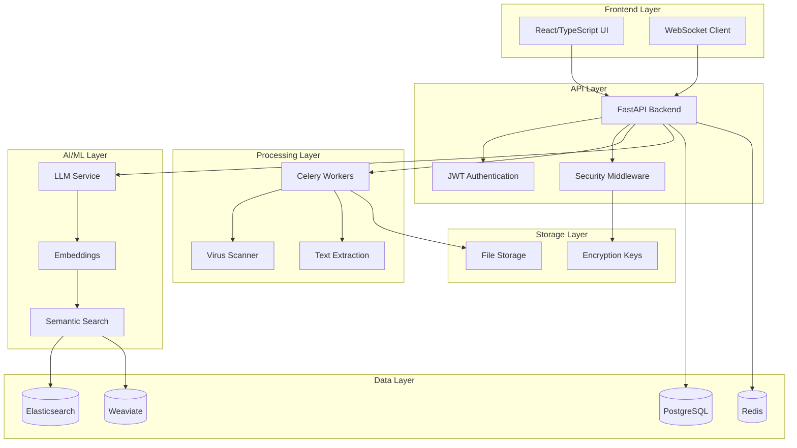

# 🚀 inDoc - Conversational Document Intelligence

<div align="center">

**Private Multi-Document AI Conversations - Dedicated AI processing with complete data isolation**

[](https://fastapi.tiangolo.com)
[](https://reactjs.org/)
[](https://postgresql.org/)
[](https://www.docker.com/)
[](https://hipaa.com/)

</div>

---

## 🌟 **Overview**

**The ONLY document AI with guaranteed data isolation.** While ChatGPT and other cloud services mix your sensitive documents with other customers' data, inDoc provides dedicated AI processing environments. Chat naturally with multiple documents simultaneously, get intelligent insights across your entire document library, and maintain complete control over your data privacy. Perfect for healthcare, finance, legal, and any organization that values data protection.

✨ **What makes inDoc different:** Your documents are processed in isolated environments with dedicated AI instances, giving you ChatGPT-level intelligence across multiple documents with complete data separation and enterprise-grade security.

## 🏢 **Flexible Deployment Options**

**🏛️ On-Premise Deployment**
- Complete infrastructure control
- Air-gapped deployments available  
- Perfect for government, defense, and maximum security needs

**☁️ Private SaaS (Dedicated Cloud)**
- Fully managed service by Shared Oxygen, LLC
- Dedicated instances with complete data isolation
- Your data never mixed with other customers
- Enterprise SLAs and 24/7 support
- HIPAA, PCI, SOC 2 compliant hosting

**🔒 Hybrid Options**
- On-premise processing with cloud management
- Edge deployments with central monitoring
- Custom configurations for unique requirements

### ✨ **Key Capabilities**

#### **Available Now**
- 🤖 **AI-Powered Conversations** - Chat naturally with your documents using Ollama LLMs
- 📄 **Multi-Document Chat** - Query across multiple documents simultaneously
- 🔐 **Enterprise Security** - Field-level encryption, comprehensive audit logging, RBAC
- 🏢 **Multi-Tenant Ready** - Complete tenant isolation for enterprise deployments
- 🔍 **Semantic Search** - Elasticsearch & Weaviate integration for intelligent retrieval
- 📁 **Document Processing** - PDF, DOCX, TXT with text extraction and chunking
- ⚡ **Real-Time Updates** - WebSocket support for live conversations
- 🚀 **Production Ready** - Docker deployment, async processing, scalable architecture

#### **Coming Soon**
- 🔮 **Proactive Insights** - Auto-discover patterns and contradictions
- 🏥 **HIPAA/PCI Compliance Modes** - Dedicated healthcare and financial compliance
- 📊 **Conversation Analytics** - Usage patterns and document heat maps
- 👥 **Team Collaboration** - Shared conversations and annotations

---

## 🏆 **Why Choose inDoc Over Cloud Alternatives?**

| Feature | ChatGPT/Claude | ChatPDF/NotionAI | **inDoc** |
|---------|----------------|------------------|-----------|
| **Data Privacy** | ❌ Mixed with other users | ❌ Shared infrastructure | ✅ **Dedicated isolated processing** |
| **Multi-Document Context** | ❌ Single document focus | ❌ Limited context | ✅ **Multiple documents simultaneously** |
| **Conversation Memory** | ⚠️ Limited context | ❌ No persistent memory | ✅ **Full conversation history** |
| **Enterprise Audit Trail** | ❌ No audit logs | ❌ Basic tracking | ✅ **Complete audit logging** |
| **HIPAA/PCI Ready** | ❌ Not compliant | ❌ Not compliant | ✅ **Built for compliance** |
| **Custom Model Support** | ❌ Fixed models | ❌ Fixed models | ✅ **Any Ollama model** |
| **Deployment Flexibility** | ❌ Cloud only | ❌ Cloud only | ✅ **On-premise OR Private SaaS** |
| **No Training on Your Data** | ❓ May train on uploads | ❓ Unknown policy | ✅ **Guaranteed never used for training** |

## 💼 **SaaS vs Self-Hosted: Choose Your Model**

### **☁️ Private SaaS (Recommended for Most)**
**Perfect for:** Growing businesses, healthcare practices, law firms, financial advisors

✅ **Zero Infrastructure Hassle** - We handle servers, updates, backups  
✅ **Dedicated Instance** - Your own private AI environment  
✅ **Enterprise Security** - SOC 2, HIPAA, PCI compliant hosting  
✅ **Instant Setup** - Live in 24 hours, not weeks  
✅ **Predictable Costs** - Monthly subscription, no infrastructure surprises  
✅ **24/7 Support** - Expert technical support included  

*"Get enterprise-grade document AI without the enterprise IT complexity"*

### **🏛️ Self-Hosted/On-Premise (Maximum Control)**
**Perfect for:** Large enterprises, government, defense, maximum security needs

✅ **Complete Control** - Your infrastructure, your rules  
✅ **Air-Gapped Option** - No internet connectivity required  
✅ **Custom Integration** - Deep integration with existing systems  
✅ **Unlimited Scale** - Add servers as needed  
✅ **One-Time License** - No recurring subscription fees  

### 💡 **Perfect For Organizations That Need:**
- 🏥 **Healthcare:** HIPAA-compliant patient record analysis
- 💰 **Financial:** PCI-compliant document processing  
- ⚖️ **Legal:** Attorney-client privileged document review
- 🏭 **Enterprise:** Trade secrets and confidential information
- 🏛️ **Government:** Classified or sensitive document analysis

---

## 🏗️ **Architecture**



---

## 🚀 **Quick Start**

### Prerequisites

- **Docker & Docker Compose** (recommended)
- **Python 3.11+** (for local development)
- **Node.js 18+** (for frontend development)
- **PostgreSQL 15+**
- **Redis 6+**
- **Elasticsearch 8+** (optional)

### 🐳 **Quick Start Options**

#### **For SaaS/Hosted Deployment:**
Contact Shared Oxygen, LLC for dedicated private cloud instances:
- ✅ **Fully managed** - We handle infrastructure, updates, backups
- ✅ **Dedicated environment** - Your data completely isolated  
- ✅ **Enterprise SLAs** - 99.9% uptime, 24/7 support
- ✅ **Compliance ready** - HIPAA, PCI, SOC 2 hosting

#### **For Self-Hosted/On-Premise:**
```bash
# Clone the repository
git clone https://github.com/sharedoxygen/indoc-app.git
cd indoc-app

# Start all services
make local-e2e

# Access the application
open http://localhost:5173
```

### 🛠️ **Manual Setup**

<details>
<summary>Click to expand manual installation steps</summary>

#### 1. Backend Setup

```bash
# Create virtual environment
python -m venv venv
source venv/bin/activate  # On Windows: venv\Scripts\activate

# Install dependencies
pip install -r requirements.txt

# Initialize database
python tools/init_db.py

# Start backend
make start-backend
```

#### 2. Frontend Setup

```bash
cd frontend
npm install
npm run dev
```

#### 3. Start Services

```bash
# Start Celery workers
make start-workers

# Start all services
make local-e2e
```

</details>

---

## 📚 **Core Features**

### 🤖 **AI-Powered Document Chat**

Engage in natural language conversations with your documents:

```python
# Example: Chat with uploaded documents
POST /api/v1/chat/conversations
{
    "message": "What are the key findings in this research paper?",
    "document_ids": ["uuid-1", "uuid-2"],
    "model": "gpt-oss:20b"
}
```

**Supported Models:**
- `gpt-oss:120b` - Best for complex reasoning and general tasks
- `deepseek-r1:70b` - Excellent for code generation and technical documents  
- `kimi-k2:72b` - Best for multilingual documents and context understanding
- `qwen2.5vl:72b` - Best for documents with images, charts, and visual content

### 📄 **Document Processing Pipeline**

1. **Upload** → Secure file validation and virus scanning
2. **Extract** → Text extraction from PDFs, DOCX, images (OCR)
3. **Chunk** → Intelligent text segmentation for optimal retrieval
4. **Index** → Multi-vector embedding and search index creation
5. **Query** → Semantic search and AI-powered responses

### 🔐 **Enterprise Security** 

#### **Implemented Security Features**
- **🔒 Field-Level Encryption** - AES-256 encryption for sensitive data fields
- **🎫 JWT Authentication** - Secure token-based API access
- **👥 Multi-Tenant Isolation** - Complete data separation with tenant_id
- **📋 Comprehensive Audit Logging** - Every action tracked with user, timestamp, and details
- **👤 Role-Based Access Control** - Admin, Reviewer, Uploader, Viewer, Compliance roles
- **🦠 File Validation** - Type checking and size limits on uploads

#### **Security Roadmap**
- **🏥 HIPAA Compliance Mode** - PHI protection and BAA support (planned)
- **💳 PCI DSS Mode** - Credit card data handling (planned)
- **🛡️ Advanced Rate Limiting** - Per-user and per-endpoint limits (planned)
- **🔍 PII Auto-Redaction** - Automatic sensitive data detection (planned)

### 🔍 **Advanced Search Capabilities**

```python
# Semantic search example
GET /api/v1/search/documents
{
    "query": "documents about machine learning algorithms",
    "semantic": true,
    "filters": {
        "date_range": "2024-01-01 to 2024-12-31",
        "file_type": ["pdf", "docx"]
    },
    "limit": 20
}
```

---

## 🔧 **Configuration**

### Environment Variables

Create a `.env` file (never commit this file):

```bash
# Database
POSTGRES_HOST=localhost
POSTGRES_PORT=5432
POSTGRES_DB=indoc
POSTGRES_USER=your_user
POSTGRES_PASSWORD=your_secure_password

# Security
JWT_SECRET_KEY=your-jwt-secret-key-here
FIELD_ENCRYPTION_KEY=your-32-byte-encryption-key-here

# AI/ML Services
OLLAMA_BASE_URL=http://localhost:11434
OLLAMA_MODEL=gpt-oss:20b

# Search
ELASTICSEARCH_URL=http://localhost:9200
WEAVIATE_URL=http://localhost:8060

# Storage
STORAGE_PATH=./data/storage
TEMP_REPO_PATH=/tmp/indoc_temp

# Monitoring (Optional)
ENABLE_TELEMETRY=true
DATADOG_API_KEY=your-datadog-key-here
GRAFANA_CLOUD_API_KEY=your-grafana-key-here
```

### Docker Configuration

The platform includes production-ready Docker configurations:

- **Multi-stage builds** for optimized container sizes
- **Health checks** for all services
- **Volume persistence** for data durability
- **Network isolation** for security

---

## 🎯 **API Documentation**

### Authentication

```bash
# Login and get access token
POST /api/v1/auth/login
{
    "username": "your-username",
    "password": "your-password"
}

# Response
{
    "access_token": "eyJ0eXAiOiJKV1QiLCJhbGciOiJIUzI1NiJ9...",
    "token_type": "bearer",
    "expires_in": 86400
}
```

### Document Management

```bash
# Upload document
POST /api/v1/documents/upload
Content-Type: multipart/form-data

# Get documents
GET /api/v1/documents?limit=20&offset=0

# Get document by ID  
GET /api/v1/documents/{document_id}

# Delete document
DELETE /api/v1/documents/{document_id}
```

### Conversation API

```bash
# Start conversation
POST /api/v1/conversations
{
    "title": "Research Discussion",
    "document_ids": ["uuid-1", "uuid-2"]
}

# Send message
POST /api/v1/conversations/{conversation_id}/messages
{
    "content": "Summarize the key points from these documents",
    "model": "gpt-oss:20b"
}

# Get conversation history
GET /api/v1/conversations/{conversation_id}/messages
```

---

## 🧪 **Testing**

### Run Test Suite

```bash
# Unit tests
pytest tests/ -v

# Integration tests  
pytest tests/integration/ -v

# End-to-end tests
python tools/e2e_test_runner.py

# Performance tests
python backend/stress_test.py
```

### Test Coverage

```bash
# Generate coverage report
pytest --cov=app tests/ --cov-report=html
open htmlcov/index.html
```

---

## 📊 **Monitoring & Observability**

### Health Checks

```bash
# Application health
GET /api/v1/health

# Database health  
GET /api/v1/health/database

# Search service health
GET /api/v1/health/search

# AI service health
GET /api/v1/health/ai
```

### Metrics

Access Prometheus metrics at `/metrics` endpoint:

- Request latency and throughput
- Document processing statistics  
- Database connection pools
- Celery task queues
- Custom business metrics

### Logging

Structured JSON logging with correlation IDs:

```python
{
    "timestamp": "2024-09-06T17:30:00Z",
    "level": "INFO", 
    "service": "document-processor",
    "correlation_id": "req-123-456",
    "message": "Document processed successfully",
    "metadata": {
        "document_id": "uuid-123",
        "processing_time": 2.34
    }
}
```

---

## 🔌 **Integrations**

### AI/ML Services

- **Ollama** - Local LLM inference
- **OpenAI API** - Cloud-based models
- **Hugging Face** - Model hosting and inference

### Search Engines

- **Elasticsearch** - Full-text and vector search
- **Weaviate** - Vector database for semantic search
- **PostgreSQL** - Hybrid search with pgvector

### Authentication

- **JWT** - Stateless authentication
- **OAuth2** - Third-party authentication
- **LDAP** - Enterprise directory integration

### Observability

- **Prometheus** - Metrics collection
- **Grafana** - Dashboards and alerting
- **DataDog** - APM and monitoring
- **Jaeger** - Distributed tracing

---

## 📈 **Performance & Scaling**

### Horizontal Scaling

```yaml
# docker-compose.scale.yml
services:
  api:
    deploy:
      replicas: 3
  
  celery-worker:
    deploy:
      replicas: 5

  frontend:
    deploy:
      replicas: 2
```

### Performance Benchmarks

| Component | Throughput | Latency |
|-----------|------------|---------|
| Document Upload | 100 files/min | < 500ms |
| Text Extraction | 50 pages/sec | < 2s |
| Semantic Search | 1000 queries/sec | < 100ms |  
| AI Chat Response | 10 tokens/sec | Variable |

---

## 🛡️ **Security & Compliance**

### Data Protection

- **Encryption at Rest** - AES-256 field-level encryption
- **Encryption in Transit** - TLS 1.3 for all connections
- **Key Management** - Secure key rotation and storage
- **Data Anonymization** - PII scrubbing capabilities

### Compliance Standards

- ✅ **HIPAA** - Healthcare data protection
- ✅ **PCI DSS** - Payment card industry standards  
- ✅ **SOC 2 Type II** - Security and availability controls
- ✅ **GDPR** - European privacy regulation
- ✅ **ISO 27001** - Information security management

### Audit & Governance

- **Comprehensive Audit Logs** - All user actions tracked
- **Data Lineage** - Document processing history
- **Access Controls** - Role-based permissions
- **Data Retention** - Configurable retention policies

---

## 🤝 **Contributing**

We welcome contributions! Please follow these guidelines when contributing to the project.

### Development Workflow

1. **Fork** the repository
2. **Create** a feature branch: `git checkout -b feature/amazing-feature`  
3. **Commit** your changes: `git commit -m 'Add amazing feature'`
4. **Push** to the branch: `git push origin feature/amazing-feature`
5. **Open** a Pull Request

### Code Standards

- **Black** - Python code formatting
- **ESLint/Prettier** - TypeScript/React formatting  
- **Type hints** - Required for all Python functions
- **Unit tests** - Required for new features
- **Documentation** - Update relevant docs

---

## 📋 **Roadmap**

### 🔮 **Upcoming Features**

- [ ] **Multi-modal AI** - Support for images, audio, video analysis
- [ ] **Advanced OCR** - Better text extraction from complex documents
- [ ] **Workflow Automation** - Document processing pipelines
- [ ] **Mobile App** - iOS and Android applications
- [ ] **Advanced Analytics** - Document insights and trends
- [ ] **Federation** - Cross-tenant search capabilities

### 🎯 **Performance Improvements**

- [ ] **Caching Layer** - Redis-based response caching
- [ ] **CDN Integration** - Static asset acceleration  
- [ ] **Database Sharding** - Horizontal database scaling
- [ ] **Edge Deployment** - Multi-region deployment support

---

## 📞 **Support**

### 📚 **Documentation**

- **API Reference** - Interactive API docs available at `/docs` when running the application
- **Quick Start** - See Docker deployment section above for fastest setup
- **Configuration** - Environment variables and settings documented above
- **Architecture** - System design diagram and component overview above

### 🐛 **Issue Reporting**

Found a bug? Please create an issue with:

1. **Environment details** (OS, Python version, etc.)
2. **Steps to reproduce** the issue
3. **Expected vs actual behavior**
4. **Relevant logs** or error messages

### 💬 **Community**

- **Discussions** - GitHub Discussions for questions and ideas
- **Discord** - Real-time chat with the community
- **Stack Overflow** - Tag your questions with `indoc`

---

## 📄 **License**

This project is open source. Please check the repository for licensing details.

---

## 🙏 **Acknowledgments**

inDoc is built with amazing open-source technologies:

- **FastAPI** - High-performance web framework
- **React** - User interface framework  
- **PostgreSQL** - Reliable database system
- **Elasticsearch** - Search and analytics engine
- **Celery** - Distributed task queue
- **Docker** - Containerization platform

---

<div align="center">

**Made with ❤️ by Shared Oxygen, LLC**

⭐ **Star this repository if you find it useful!** ⭐

</div>