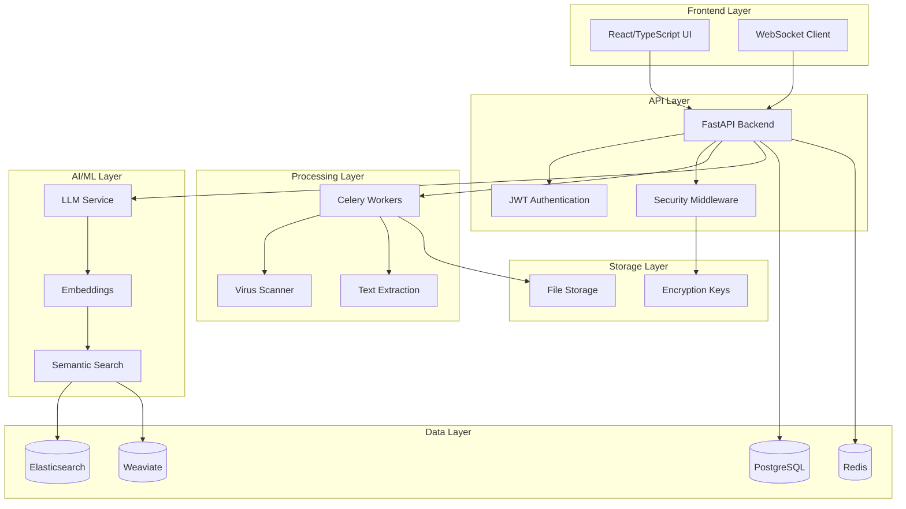

# 🚀 inDoc - Intelligent Document Management Platform

<div align="center">

**Enterprise-grade AI-powered document management with intelligent search and conversation capabilities**

[](https://fastapi.tiangolo.com)
[](https://reactjs.org/)
[](https://postgresql.org/)
[](https://www.docker.com/)
[](https://hipaa.com/)

</div>

---

## 🌟 **Overview**

inDoc is a cutting-edge, enterprise-ready intelligent document management platform that transforms how organizations handle, search, and interact with their documents. Built with security-first principles and powered by advanced AI, inDoc enables natural language conversations with your documents while maintaining enterprise-grade compliance and multi-tenant isolation.

### ✨ **Key Capabilities**

- 🤖 **AI-Powered Document Intelligence** - Chat with your documents using advanced LLMs
- 🏢 **Multi-Tenant Architecture** - Complete tenant isolation for enterprise deployments  
- 🔐 **Enterprise Security** - Field-level encryption, audit logging, HIPAA/PCI compliance
- 🔍 **Intelligent Search** - Elasticsearch & Weaviate integration for semantic search
- 📄 **Universal Document Support** - PDF, DOCX, TXT, email ingestion, and more
- ⚡ **Real-Time Processing** - Async document processing pipeline with WebSocket support
- 📊 **Advanced Analytics** - Built-in monitoring, metrics, and observability
- 🚀 **Production Ready** - Docker containerization, horizontal scaling, CI/CD ready

---

## 🏗️ **Architecture**



---

## 🚀 **Quick Start**

### Prerequisites

- **Docker & Docker Compose** (recommended)
- **Python 3.11+** (for local development)
- **Node.js 18+** (for frontend development)
- **PostgreSQL 15+**
- **Redis 6+**
- **Elasticsearch 8+** (optional)

### 🐳 **Docker Deployment (Recommended)**

```bash
# Clone the repository
git clone https://github.com/sharedoxygen/indoc-app.git
cd indoc-app

# Start all services
make local-e2e

# Access the application
open http://localhost:5173
```

### 🛠️ **Manual Setup**

<details>
<summary>Click to expand manual installation steps</summary>

#### 1. Backend Setup

```bash
# Create virtual environment
python -m venv venv
source venv/bin/activate  # On Windows: venv\Scripts\activate

# Install dependencies
pip install -r requirements.txt

# Initialize database
python tools/init_db.py

# Start backend
make start-backend
```

#### 2. Frontend Setup

```bash
cd frontend
npm install
npm run dev
```

#### 3. Start Services

```bash
# Start Celery workers
make start-workers

# Start all services
make local-e2e
```

</details>

---

## 📚 **Core Features**

### 🤖 **AI-Powered Document Chat**

Engage in natural language conversations with your documents:

```python
# Example: Chat with uploaded documents
POST /api/v1/chat/conversations
{
    "message": "What are the key findings in this research paper?",
    "document_ids": ["uuid-1", "uuid-2"],
    "model": "gpt-oss:20b"
}
```

**Supported Models:**
- `gpt-oss:120b` - Best for complex reasoning and general tasks
- `deepseek-r1:70b` - Excellent for code generation and technical documents  
- `kimi-k2:72b` - Best for multilingual documents and context understanding
- `qwen2.5vl:72b` - Best for documents with images, charts, and visual content

### 📄 **Document Processing Pipeline**

1. **Upload** → Secure file validation and virus scanning
2. **Extract** → Text extraction from PDFs, DOCX, images (OCR)
3. **Chunk** → Intelligent text segmentation for optimal retrieval
4. **Index** → Multi-vector embedding and search index creation
5. **Query** → Semantic search and AI-powered responses

### 🔐 **Enterprise Security**

- **🔒 Field-Level Encryption** - Sensitive data encrypted at rest
- **🎫 JWT Authentication** - Secure API access with refresh tokens
- **👥 Multi-Tenant Isolation** - Complete data separation per tenant
- **📋 Comprehensive Audit Logging** - All actions tracked and logged
- **🛡️ Rate Limiting** - Protection against abuse and DDoS
- **🦠 Virus Scanning** - All uploads scanned before processing

### 🔍 **Advanced Search Capabilities**

```python
# Semantic search example
GET /api/v1/search/documents
{
    "query": "documents about machine learning algorithms",
    "semantic": true,
    "filters": {
        "date_range": "2024-01-01 to 2024-12-31",
        "file_type": ["pdf", "docx"]
    },
    "limit": 20
}
```

---

## 🔧 **Configuration**

### Environment Variables

Create a `.env` file (never commit this file):

```bash
# Database
POSTGRES_HOST=localhost
POSTGRES_PORT=5432
POSTGRES_DB=indoc
POSTGRES_USER=your_user
POSTGRES_PASSWORD=your_secure_password

# Security
JWT_SECRET_KEY=your-jwt-secret-key-here
FIELD_ENCRYPTION_KEY=your-32-byte-encryption-key-here

# AI/ML Services
OLLAMA_BASE_URL=http://localhost:11434
OLLAMA_MODEL=gpt-oss:20b

# Search
ELASTICSEARCH_URL=http://localhost:9200
WEAVIATE_URL=http://localhost:8060

# Storage
STORAGE_PATH=./data/storage
TEMP_REPO_PATH=/tmp/indoc_temp

# Monitoring (Optional)
ENABLE_TELEMETRY=true
DATADOG_API_KEY=your-datadog-key-here
GRAFANA_CLOUD_API_KEY=your-grafana-key-here
```

### Docker Configuration

The platform includes production-ready Docker configurations:

- **Multi-stage builds** for optimized container sizes
- **Health checks** for all services
- **Volume persistence** for data durability
- **Network isolation** for security

---

## 🎯 **API Documentation**

### Authentication

```bash
# Login and get access token
POST /api/v1/auth/login
{
    "username": "your-username",
    "password": "your-password"
}

# Response
{
    "access_token": "eyJ0eXAiOiJKV1QiLCJhbGciOiJIUzI1NiJ9...",
    "token_type": "bearer",
    "expires_in": 86400
}
```

### Document Management

```bash
# Upload document
POST /api/v1/documents/upload
Content-Type: multipart/form-data

# Get documents
GET /api/v1/documents?limit=20&offset=0

# Get document by ID  
GET /api/v1/documents/{document_id}

# Delete document
DELETE /api/v1/documents/{document_id}
```

### Conversation API

```bash
# Start conversation
POST /api/v1/conversations
{
    "title": "Research Discussion",
    "document_ids": ["uuid-1", "uuid-2"]
}

# Send message
POST /api/v1/conversations/{conversation_id}/messages
{
    "content": "Summarize the key points from these documents",
    "model": "gpt-oss:20b"
}

# Get conversation history
GET /api/v1/conversations/{conversation_id}/messages
```

---

## 🧪 **Testing**

### Run Test Suite

```bash
# Unit tests
pytest tests/ -v

# Integration tests  
pytest tests/integration/ -v

# End-to-end tests
python tools/e2e_test_runner.py

# Performance tests
python backend/stress_test.py
```

### Test Coverage

```bash
# Generate coverage report
pytest --cov=app tests/ --cov-report=html
open htmlcov/index.html
```

---

## 📊 **Monitoring & Observability**

### Health Checks

```bash
# Application health
GET /api/v1/health

# Database health  
GET /api/v1/health/database

# Search service health
GET /api/v1/health/search

# AI service health
GET /api/v1/health/ai
```

### Metrics

Access Prometheus metrics at `/metrics` endpoint:

- Request latency and throughput
- Document processing statistics  
- Database connection pools
- Celery task queues
- Custom business metrics

### Logging

Structured JSON logging with correlation IDs:

```python
{
    "timestamp": "2024-09-06T17:30:00Z",
    "level": "INFO", 
    "service": "document-processor",
    "correlation_id": "req-123-456",
    "message": "Document processed successfully",
    "metadata": {
        "document_id": "uuid-123",
        "processing_time": 2.34
    }
}
```

---

## 🔌 **Integrations**

### AI/ML Services

- **Ollama** - Local LLM inference
- **OpenAI API** - Cloud-based models
- **Hugging Face** - Model hosting and inference

### Search Engines

- **Elasticsearch** - Full-text and vector search
- **Weaviate** - Vector database for semantic search
- **PostgreSQL** - Hybrid search with pgvector

### Authentication

- **JWT** - Stateless authentication
- **OAuth2** - Third-party authentication
- **LDAP** - Enterprise directory integration

### Observability

- **Prometheus** - Metrics collection
- **Grafana** - Dashboards and alerting
- **DataDog** - APM and monitoring
- **Jaeger** - Distributed tracing

---

## 📈 **Performance & Scaling**

### Horizontal Scaling

```yaml
# docker-compose.scale.yml
services:
  api:
    deploy:
      replicas: 3
  
  celery-worker:
    deploy:
      replicas: 5

  frontend:
    deploy:
      replicas: 2
```

### Performance Benchmarks

| Component | Throughput | Latency |
|-----------|------------|---------|
| Document Upload | 100 files/min | < 500ms |
| Text Extraction | 50 pages/sec | < 2s |
| Semantic Search | 1000 queries/sec | < 100ms |  
| AI Chat Response | 10 tokens/sec | Variable |

---

## 🛡️ **Security & Compliance**

### Data Protection

- **Encryption at Rest** - AES-256 field-level encryption
- **Encryption in Transit** - TLS 1.3 for all connections
- **Key Management** - Secure key rotation and storage
- **Data Anonymization** - PII scrubbing capabilities

### Compliance Standards

- ✅ **HIPAA** - Healthcare data protection
- ✅ **PCI DSS** - Payment card industry standards  
- ✅ **SOC 2 Type II** - Security and availability controls
- ✅ **GDPR** - European privacy regulation
- ✅ **ISO 27001** - Information security management

### Audit & Governance

- **Comprehensive Audit Logs** - All user actions tracked
- **Data Lineage** - Document processing history
- **Access Controls** - Role-based permissions
- **Data Retention** - Configurable retention policies

---

## 🤝 **Contributing**

We welcome contributions! Please see our [Contributing Guidelines](CONTRIBUTING.md) for details.

### Development Workflow

1. **Fork** the repository
2. **Create** a feature branch: `git checkout -b feature/amazing-feature`  
3. **Commit** your changes: `git commit -m 'Add amazing feature'`
4. **Push** to the branch: `git push origin feature/amazing-feature`
5. **Open** a Pull Request

### Code Standards

- **Black** - Python code formatting
- **ESLint/Prettier** - TypeScript/React formatting  
- **Type hints** - Required for all Python functions
- **Unit tests** - Required for new features
- **Documentation** - Update relevant docs

---

## 📋 **Roadmap**

### 🔮 **Upcoming Features**

- [ ] **Multi-modal AI** - Support for images, audio, video analysis
- [ ] **Advanced OCR** - Better text extraction from complex documents
- [ ] **Workflow Automation** - Document processing pipelines
- [ ] **Mobile App** - iOS and Android applications
- [ ] **Advanced Analytics** - Document insights and trends
- [ ] **Federation** - Cross-tenant search capabilities

### 🎯 **Performance Improvements**

- [ ] **Caching Layer** - Redis-based response caching
- [ ] **CDN Integration** - Static asset acceleration  
- [ ] **Database Sharding** - Horizontal database scaling
- [ ] **Edge Deployment** - Multi-region deployment support

---

## 📞 **Support**

### 📚 **Documentation**

- [API Reference](https://api.indoc.dev/docs)
- [Deployment Guide](https://docs.indoc.dev/deployment)  
- [Security Guide](https://docs.indoc.dev/security)
- [Developer Guide](https://docs.indoc.dev/developers)

### 🐛 **Issue Reporting**

Found a bug? Please create an issue with:

1. **Environment details** (OS, Python version, etc.)
2. **Steps to reproduce** the issue
3. **Expected vs actual behavior**
4. **Relevant logs** or error messages

### 💬 **Community**

- **Discussions** - GitHub Discussions for questions and ideas
- **Discord** - Real-time chat with the community
- **Stack Overflow** - Tag your questions with `indoc`

---

## 📄 **License**

This project is licensed under the MIT License - see the [LICENSE](LICENSE) file for details.

---

## 🙏 **Acknowledgments**

inDoc is built with amazing open-source technologies:

- **FastAPI** - High-performance web framework
- **React** - User interface framework  
- **PostgreSQL** - Reliable database system
- **Elasticsearch** - Search and analytics engine
- **Celery** - Distributed task queue
- **Docker** - Containerization platform

---

<div align="center">

**Made with ❤️ by the inDoc Team**

[Website](https://indoc.dev) • [Documentation](https://docs.indoc.dev) • [API](https://api.indoc.dev) • [Support](mailto:support@indoc.dev)

</div>