# inDoc

**Your documents. Your questions. Instant answers.**

*A scalable enterprise RAG platform engineered for accuracy and strategic flexibility. It leverages hybrid semantic search to retrieve the most relevant information, the Model Context Protocol (MCP) for precise, tool-augmented reasoning, and a multi-provider LLM orchestration layer to optimize for cost, performance, and vendor independence.*

[](LICENSE)
[](https://fastapi.tiangolo.com)
[](https://reactjs.org/)

---

## Why inDoc?

### Have a Real Conversation with Your Documents
inDoc helps individuals and enterprises find answers in their documents—whether you're managing patient records in healthcare, tracking financial transactions, preserving institutional knowledge, or organizing personal archives. It works with any file format, regardless of age: a PDF scan of a 100‑year‑old ledger, a handwritten clinical note, a price‑sheet spreadsheet, an email export, or a legacy code repository. If you can store it, you can query it.

Point inDoc at a folder (or an entire archive), ask natural‑language questions, and get answers backed by citations to the source documents. No more digging through nested folders, opening dozens of files, or guessing which version is the right one. inDoc handles modern and legacy formats—even when the original tools no longer exist or won't run on current machines.

<div align="center">

### 📚 → 💬 → 🔍 → ✓


**🏛️ Legacy Documents** → **🔍 Hybrid Search** → **🧠 AI + MCP** → **✓ Verified Answers**

*Enterprise RAG on your infrastructure*

</div>

---

## Compliance & Governance

inDoc is designed for controlled, private deployments. It provides the technical controls required to build compliant solutions; formal certification depends on how you operate the platform within your environment (shared‑responsibility model).

**Built‑in controls**
- Data residency & isolation: single‑tenant or strongly isolated multi‑tenant; deploy on‑prem or private cloud.
- Access governance: granular document‑level permissions, least‑privilege roles, optional MFA, session controls.
- Audit & traceability: immutable audit logs for uploads, searches, retrievals, and AI interactions; SIEM export.
- PHI/PII safety: optional PHI/PII detection, policy‑based redaction, allow/deny patterns before indexing or answering.
- Retention & right‑to‑erasure: API/CLI for export/delete; atomic delete across PostgreSQL, Elasticsearch, Qdrant, and file/object storage.
- Encryption: TLS in transit; at‑rest encryption and KMS integration; optional field‑level encryption for sensitive metadata.
- Model governance: retrieval‑first, minimum 3 citations, abstain on insufficient evidence; prompt/response logging with redaction.
- Default privacy posture: external LLMs disabled; local inference via Ollama; no telemetry by default.

**Regulatory alignment (guidance)**
- GDPR/CCPA: data stays in your residency boundary; subject rights supported via export/delete; data minimization and retention policies.
- HIPAA: when deployed with local inference and encryption, inDoc supports HIPAA‑aligned controls (access, audit, integrity). PHI redaction available. BAA/operational safeguards are the operator's responsibility.
- PCI DSS: inDoc is not a payment processor; use DLP rules to prevent PAN ingestion; encryption, segmentation, and audit trails provided to support PCI‑scoped environments.
- SOC 2: provides technical controls aligned to Security/Availability/Confidentiality (access control, logging, change management hooks). Attestation depends on your org's processes.

---

### InDoc can Answer:

- "Give me a timeline of all contract renewals from 2010 to 2024, and flag any that overlap."
  - Extracts dates from contracts, builds a chronological view, and highlights overlapping periods — all with source citations.

- "What is the relationship among the engineering specifications, the testing reports, and the release notes for Project X?"
  - Maps cross‑references (part numbers, version IDs, dates) across PDFs, spreadsheets, and markdown files, then summarizes the linkage hierarchy.

- "Summarize the key regulatory changes that appeared in our compliance manuals between 2015 and 2020."
  - Pulls the relevant sections from all compliance documents, synthesizes the changes, and cites each paragraph.

- "Which patient records mention ‘beta‑blocker’ and were created before 2000?"
  - Searches scanned medical PDFs (via OCR), filters by drug name and date, and returns a count plus a list of matching files.
 
- "How many unique customers appear across all sales invoices, and what is the total revenue per region?"
  - Aggregates data from thousands of invoice PDFs/Excel files, deduplicates customer IDs, and summarizes revenue by geographic region.

These are just a few of the real, executive‑level questions you can ask — across any document type, format, or era.

### Why it matters

- **Speed**: Answers appear in seconds, not hours of manual searching.
- **Trust**: Every fact is accompanied by a citation to the original file, page, and snippet — no hallucinations.
- **Security**: The entire pipeline runs on‑prem or in your private cloud; your confidential data never leaves your control.
- **Universality**: Works with PDFs, Word, Excel, CSV, images (OCR), emails, code, markdown, and more — across industries.
- **Legacy‑Resilient**: Reads and normalizes legacy formats so decades‑old documents remain searchable and useful.

---

## Architecture

### The Conversation Intelligence Pipeline

```mermaid
%%{init: {'theme':'dark', 'themeVariables': { 'primaryColor':'#1976d2','primaryTextColor':'#fff','primaryBorderColor':'#1565c0','lineColor':'#42a5f5','secondaryColor':'#00897b','tertiaryColor':'#7b1fa2','fontSize':'16px'}}}%%

graph TB
    %% User Layer
    User["👤 User<br/>Natural Language Questions"]
    
    %% Frontend Layer
    subgraph Frontend["🎨 Frontend Layer"]
        UI["React 18 + TypeScript<br/>Material-UI Components<br/>Redux State Management"]
    end
    
    %% API Gateway
    API["⚡ FastAPI Gateway<br/>REST + WebSocket<br/>JWT Auth + RBAC"]
    
    %% Intelligence Layer
    subgraph Intelligence["🧠 AI Intelligence Layer"]
        Intent["Intent<br/>Detection"]
        Context["Context<br/>Manager"]
        LLM1["🤖 Ollama<br/>(Primary)"]
        LLM2["🌐 OpenAI<br/>(Fallback)"]
        Grounding["✓ Answer<br/>Grounding"]
    end
    
    %% Search Layer
    subgraph Search["🔍 Hybrid Search Engine"]
        direction LR
        ES["Elasticsearch<br/>⚡ Keyword Search<br/>BM25 Scoring"]
        Qdrant["Qdrant<br/>🎯 Semantic Search<br/>Vector Embeddings"]
        Rerank["🎖️ Reranker<br/>Fusion + Boost"]
    end
    
    %% Data Layer
    subgraph Data["💾 Data & Processing Layer"]
        PG["PostgreSQL<br/>Documents & Users<br/>Conversations"]
        Redis["Redis<br/>Cache & Sessions<br/>Job Queue"]
        Celery["Celery<br/>Document Processing<br/>Embeddings<br/>Indexing"]
    end
    
    %% Storage Layer  
    subgraph Storage["📁 Storage Layer"]
        Local["Local FileSystem<br/>Primary Storage"]
        S3["S3 Compatible<br/>Object Storage<br/>(Optional)"]
    end
    
    %% Flow
    User -->|"Ask Question"| UI
    UI -->|"HTTP/WS"| API
    API -->|"Route"| Intent
    
    Intent -->|"Analytics"| PG
    Intent -->|"Document Query"| Search
    
    ES -.->|"Keyword Results"| Rerank
    Qdrant -.->|"Semantic Results"| Rerank
    Rerank -->|"Top K Docs"| Context
    
    Context -->|"Build Prompt"| LLM1
    LLM1 -.->|"Failover"| LLM2
    LLM1 -->|"Response"| Grounding
    LLM2 -.->|"Response"| Grounding
    
    Grounding -->|"Verified Answer"| API
    API -->|"Stream/Return"| UI
    UI -->|"Display"| User
    
    %% Background Processing
    API -->|"Upload"| Storage
    Storage -->|"Process"| Celery
    Celery -->|"Extract Text"| PG
    Celery -->|"Index Keywords"| ES
    Celery -->|"Generate Embeddings"| Qdrant
    
    %% Data Connections
    API -.->|"Query"| PG
    API -.->|"Cache"| Redis
    Celery -.->|"Jobs"| Redis
    
    %% Styling
    classDef frontend fill:#1976d2,stroke:#1565c0,stroke-width:3px,color:#fff
    classDef api fill:#00897b,stroke:#00695c,stroke-width:3px,color:#fff
    classDef ai fill:#7b1fa2,stroke:#6a1b9a,stroke-width:3px,color:#fff
    classDef search fill:#f57c00,stroke:#ef6c00,stroke-width:3px,color:#fff
    classDef data fill:#0288d1,stroke:#0277bd,stroke-width:3px,color:#fff
    classDef storage fill:#5e35b1,stroke:#512da8,stroke-width:3px,color:#fff
    
    class UI frontend
    class API api
    class Intent,Context,LLM1,LLM2,Grounding ai
    class ES,Qdrant,Rerank search
    class PG,Redis,Celery data
    class Local,S3 storage
```



**Key Principles:**
- **MCP Architecture:** Model Context Protocol providers for search, retrieval, and tool execution
- **Hybrid Search:** Elasticsearch + Qdrant run concurrently, results merged and reranked
- **Answer Grounding:** Every response verified against retrieved sources (min 3 docs)
- **Multi-Provider LLM:** Automatic failover (Ollama → OpenAI)
- **Privacy First:** Self-hosted, data never leaves your infrastructure

---

## Tech Stack

**Frontend:** React 18 • TypeScript • Material-UI • Redux  
**Backend:** FastAPI • Python 3.11 • Async  
**Search:** Elasticsearch + Qdrant (hybrid)  
**LLM:** Ollama (local) + OpenAI (fallback)  
**MCP:** SearchProvider • RetrievalProvider • ToolProvider  
**Data:** PostgreSQL • Redis • Celery  
**Deploy:** Docker Compose

---

## Documentation

- **Getting Started** - `docs/CHAT_USER_GUIDE.md` - User guide for chat features
- **API Reference** - http://localhost:8000/api/v1/docs - OpenAPI documentation (when running)
- **Contributing** - `docs/CONTRIBUTING.md` - Development guidelines and workflow

---

## Requirements

- **Docker** & Docker Compose (recommended)  
  OR
- **Python 3.11+**, **Node 18+**, **PostgreSQL**, **Redis**, **Elasticsearch**, **Qdrant**

**RAM:** 8GB minimum, 16GB recommended  
**Storage:** 10GB + your documents

---

## Quick Start

```bash
# Clone or navigate to your inDoc directory
cd indoc

# Start the full development stack
make dev
```

Open **http://localhost:5173** and login with demo credentials:
- **Admin:** `admin@indoc.local` / `Admin123!`
- **Manager:** `manager@indoc.local` / `Manager123!`
- **Analyst:** `analyst@indoc.local` / `Analyst123!`

---

## Configuration

inDoc uses configuration files and environment variables:

**Configuration Files:**
- `config/default.yaml` - Default settings
- `config/local.yaml` - Local overrides (gitignored)
- `.env` - Sensitive credentials (gitignored)

**Key Settings:**
```yaml
# config/local.yaml
llm:
  provider: ollama  # or openai
  model: llama3.2:latest

search:
  elasticsearch_url: http://localhost:9200
  qdrant_url: http://localhost:6333
```

---

## Contributing

We welcome contributions! See `docs/CONTRIBUTING.md` for:
- Code style guidelines
- Development workflow
- Testing requirements
- Pull request process

**inDoc is open source (MIT License).** Use it, modify it, share it.

---

## License

**MIT License** - Free and Open Source

Copyright © 2025 Shared Oxygen, LLC

See `LICENSE` file for full details.

---

## About

**inDoc** is created by **Shared Oxygen, LLC** - an AI and Data Advisory company.

**Contact:**
- Website: www.sharedoxygen.com
- Email: info@sharedoxygen.com

---

*Ask better questions. Get better answers. Start with inDoc.*
